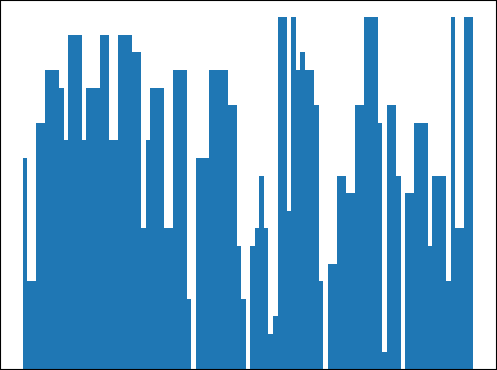

# SkylineBot

Documentació del projecte SkylineBot fet per l'estudiant Marc Monfort Grau.


## Instruccions

Instruccions per tenir a punt el codi del projecte.

### Prerequisits i instal·lació
1. Instal·lar Python3
    ```bash
    sudo apt install python3
    ```
2. Instal·lar i configurar Telegram.
3. Instal·lar la llibreria [python-telegram-bot](https://github.com/python-telegram-bot/python-telegram-bot).
    ```
    pip3 install python-telegram-bot
    ```
4. Obtenir un `Access token` de Telegram per identificar el bot.
    * Visiteu [@BotFather](https://telegram.me/botfather).
    * Useu la comanda /newbot per obtenir el `token`.
    * Deseu en un fitxer `token.txt` el vostre *access token*.
    * Utilitzeu l'adreça del bot per utilitzar el SkylineBot.

5. Instal·lar la llibreria [Matplotlib](https://matplotlib.org/).
    ```bash
    pip3 install matplotlib
    ```
6. Instal·lar el *runtime* de python per [ANTLR4](https://www.antlr.org/).
    ```bash
    pip3 install antlr4-python3-runtime
    ```

## Execució del bot

Executem el bot:

```bash
python3 bot.py
```

Des de l'adreça obtinguda amb [@BotFather](https://telegram.me/botfather) ja podem executar les comandes del SkylineBot

### Comandes del bot

#### /start
Inicia la conversació amb el Bot.

#### /help
Mostra les comandes disponibles i una breu descripció de cada una.

#### /author
Mostra el nom de l'autor i el correu electrònic. En aquest cas la sortida serà:
```
Marc Monfort Grau
marc.monfort@est.fib.upc.edu
```

#### /lst
Mostra els identificadors de *skylines* definits, i la seva corresponent àrea. No mostra els identificadors d'enters.<br>
Els identificadors són guardats independentment per cada usuari utilitzant el diccionari **context.user_data**, de la llibreria de Telegram.

#### /clean
Esborra tots els identificadors definits, simplement esborrant totes les entrades de **context.user_data**.

#### /save id
Guarda el *skyline* definit amb l'identificador *id* a una base de dades permanent. <br>
Utilitzem la llibreria **pickle** per generar un arxiu que contindrà l'estructura del *skyline* amb nom **id.sky** i que el guardarem a la carpeta `/database/num_id_usuari`. Si encara no existeix la carpeta per l'usuari, es crearà una nova.

#### /load id
Carrega el *skyline* guardat a la carpeta `/database/num_id_usuari` amb el nom **id.sky** i sobreescriu (si ja existeix) l'identificador *id* del diccionari **context.user_data**.

#### Missatges

Tots els missatges que enviem al bot i que no comencin amb una comanda seran tractats pel compilador. Si es detecta un *skyline* en el missatge, aquest serà representat per pantalla amb la llibreria **matplotlib**, junt amb la seva àrea i alçada màxima.

Per poder enviar la imatge generada amb **matplotlib** a través de Telegram, guardarem un arxiu temporal amb nom *id_usuari_tmp.png* que després de ser enviat l'eliminarem.

Tots els errors que es detectin, tant a l'hora d'utilitzar les comandes del bot, com errors en la compilació, seran informats a l'usuari amb un missatge informatiu començant per la icona 💣.

## Gramàtica

La gramàtica del llenguatge permet la declaració d'un *skyline* en cada missatge enviat (no més d'un). Aquest Skyline el podem assignar a un identificador. En l'[enunciat](https://github.com/gebakx/SkylineBot) de la pràctica es troba la notació del llenguatge per a la creació de *skylines* i les operacions entre ells. Per donar més llibertat al llenguatge, la nostra gramàtica permet, en tot moment, utilitzar els operadors d'enters de **suma**, **resta**, **multiplicació**, **divisió** i **potència** per definir els valors en la creació dels *skylines*. També és possible assignar un enter a un identificador, però aquest no serà representat quan s'utilitzi la comanda `/lst`.


## Visitor

La llibreria **ANTLR4** ens fa automàticament la comprovació lèxica i sintàctica de l'entrada. Només ens queda comprovar la semàntica i executar-ho.<br>

Al començament tenia la intenció de definir dos *visitors* per recórrer l'**arbre de parsing** que també és generat per **ANTLR4**. El primer *visitor* seria per comprovar la semàntica i el segon per executar l'entrada. Finalment, com que el llenguatge en qüestió no pot tenir molts errors semàntics (la majora d'errors es detectaran a l'anàlisi sintàctic), i com que estem interpretant el llenguatge amb Python (no generem cap codi), he decidit implementar un únic *visitor* que farà les dues coses alhora.<br>

Per programar el *visitor* he fet ús de **tags** en la gramàtica per facilitar la declaració de les funcions que visiten els nodes de l'arbre de *parsing*. Com que el llenguatge admet l'ús d'identificadors i d'assignacions, per instanciar el *visitor* passem per paràmetre un diccionari que contindrà l'assignació de tots els identificadors prèviament declarats, i que s'utilitzarà per guardar els nous identificadors que es declarin. Aquest diccionari correspon al **context.user_data** ja mencionat anteriorment.

Com que estem avaluant el resultat de l'expressió, el *visitor* retornarà el *skyline* expressat. També pot retornar un enter si no hem expressat cap *skyline*.

En totes les situacions on s'incompleixi la semàntica del llenguatge, executarem un **raise Exception** amb el missatge d'error corresponent.

## Classe Skyline

Utilitzarem la classe Skyline per a la gestió dels *skylines*.

L'objectiu d'aquesta classe es poder facilitar la representació i les operacions dels *skylines*. La representació del *skyline* es pot simplificar com a un diagrama de barres, on cada barra representa un edifici. Amb la llibreria **matplotlib** tenim disponible la funció **bar** que ens permet definir el diagrama passant com a paràmetre una primera llista amb la posició inicial de cada barra, una segona llista amb l'altura, i una tercera llista amb l'amplada.

Seguint aquest model, la nostra classe Skyline tindrà com a atributs aquestes tres llistes anomenades **start**, **height** i **width**.

### Constructors
La funció **__init__** ens permet instanciar un nou *skyline* passant com a paràmetre les tres llistes mencionades.

També definim dos constructors més utilitzant **@classmethod**.
* **single(xmin,top,xmax)**: Retorna una instància d'un Skyline amb un sol edifici definit amb la posició inicial, la posició final, i l'alçada.
* **random(n,h,w,xmin,xmax)**: Genera un Skyline d'**n** edificis, amb una alçada aleatòria entre **0** i **h**, amb una amplada aleatòria entre **1** i **w**, i una posició d'inici i de final aleatòria entre **xmin** i **xmax**.

### Unió
Fem una sobrecàrrega de l'operador **__add__**. D'aquesta forma facilitarà la feina al *visitor* de la gramàtica per fer les operacions amb Skylines.

La unió retornarà una nova instància de Skyline que tindrà com a atribut la unió de cada una de les 3 llistes dels dos Skylines de l'operació.

### Intersecció
Fem sobrecàrrega de l'operador **__mul__**.

Busquem la secció on interseccionen els dos *skylines*. Per facilitar la feina **normalitzem** aquesta part dels dos *Skylines* creant dues llistes, on cada posició representa una unitat d'amplada, i el valor en aquesta posició representa l'alçada visible (la màxima entre tots els edificis en aquell punt). A continuació només em de construir una nova llista amb el mínim valor d'entre les dues llistes normalitzades. Aquesta nova llista representarà la intersecció dels *skylines*. Finalment utilitzem la funció **simplify** que a partir d'una llista normalitzada retornarà les 3 llistes que representen la posició inicial, l'alçada i l'amplada dels edificis d'un *skyline*. Retornem un nou Skyline amb aquestes 3 llistes com a atribut.

### Replicació
Fem sobrecàrrega de l'operador **__mul__**. Cas on el segon operant és un enter (**N**).

Utilitzant la funció **minNmax** calculem el *offset* (distancia entre la posició del primer edifici i la posició de l'últim edifici). Retornem un nou Skyline amb la llista de l'alçada i l'amplada replicades **N** cops, i la llista de la posició inicial replicada **N** cops, però per cada replicació sumem a cada element *offset* * *num_replicació*.


### Desplaçament
Pel desplaçament a la dreta fem sobrecàrrega de l'operador **__add__**. Pel desplaçament a l'esquerra fem sobrecàrrega de l'operador **__sub__**.

En els dos casos retornem un nou Skyline augmentant (o restant en el desplaçament a l'esquerra) en **N** el valor de tots els elements de la llista **start**. La llista **height** i **width** no es modificaran.

Quan fem un desplaçament a l'esquerra es pot donar el cas que alguns o tots els edificis es trobin en una posició negativa. Aquests edificis no s'haurien de veure quan representem el *skyline*. Una solució podria ser eliminar tots els edificis de la part negativa, però per evitar problemes de consistència derivarem aquest problema a la funció **plot** encarregada de graficar el *skyline* i de moment conservarem tots els edificis. Aquesta solució també ens permet que posteriorment puguem fer un desplaçament a la dreta per recuperar la visualització dels edificis que es trobin en posicions negatives. 

### Mirall
Fem sobrecàrrega de l'operador **__neg__**.

Calculem la posició del primer edifici i de l'últim edifici. A continuació desplacem tots els edificis dos cops la distància fins a l'últim edifici i restem la seva amplada. Després traslladem tots els edificis a l'interval que ocupaven inicialment.

Per ser consistents amb la solució optada anteriorment, també considerem els edificis en posicions negatives en l'operació mirall. Això ens pot crear situacions on en fer el mirall, part dels edificis que són visibles, passin a no ser-ho per trobar-se a la part negativa.

### Representació del Skyline (plot)
Definim la funció **plot** que utilitza la funció **bar** de la llibreria **matplotlib** per crear el diagrama de barres per representar el *skyline*. Hem de tenir en compte que la generació de la gràfica de barres té un cost elevat. Per això abans de generar la gràfica tractarem el *skyline* per intentar reduir al màxim el nombre d'edificis del diagrama.

Aquesta reducció consisteix primer de tot a eliminar els edificis que es trobin a la part negativa, després eliminar els edificis amb altura 0 o amplada 0, a continuació eliminar els edificis tapats per edificis més grans, i finalment representar com un únic edifici el conjunt d'edificis que es trobin junts i que tinguin la mateixa altura. 

De fet, amb la funció **normalize** i **simplify** podem aconseguir totes aquestes reduccions alhora: Normalitzem la part positiva del Skyline, i apliquem la funció **simplify** a la llista normalitzada per que ens retorni els vectors **start**, **height** i **width** reduïts. Aquesta funció a de recórrer els elements de la llista normalitzada i afegir un edifici quan detecta que un dels elements té una alçada diferent de l'anterior. Si l'alçada fos zero, no afegeix cap edifici. 

Per poder mantenir una coherència pel que fa al desplaçament a la dreta del *skyline*, representarem sempre el *skyline* des de la posició 0 fins a la posició de l'últim edifici. Per això abans de generar el diagrama de barres, afegim un edifici d'altura 0 (invisible) al començament de la gràfica. També afegim un altre edifici amb amplada 0 (invisible) i altura 1 per així evitar veure l'eix **y** negatiu quan el *skyline* no tingui cap edifici. També indiquem que només es mostrin enters per representar l'amplada i l'alçada del *skyline*.

La funció **plot** a més de crear el graf de barres, retornarà el valor de l'àrea i de l'alçada màxima del *skyline*. Per calcular l'àrea únicament sumem tots els elements de la llista normalitzada, i per calcular l'alçada màxima només hem de trobar el màxim d'entre tots els elements de la mateixa llista normalitzada. També està definida la funció **getArea** que retornarà l'àrea del *skyline* (sense contar els edificis de la part negativa) però sense generar la gràfica de barres.

## Autor
Marc Monfort Grau <br>
marc.monfort@est.fib.upc.edu

## Llicència
Cap llicència.
